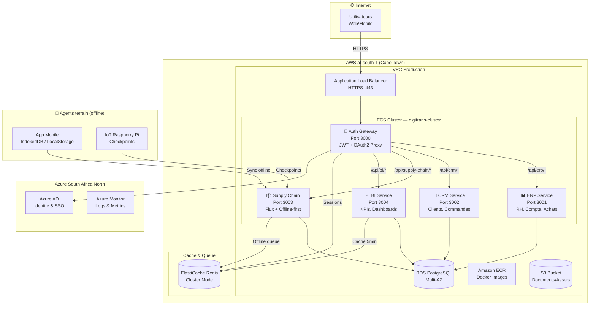
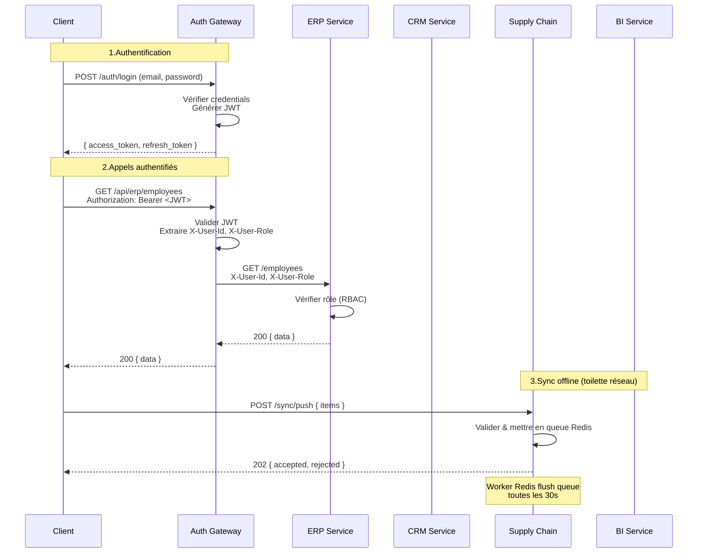
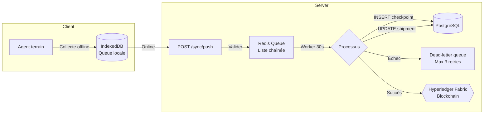
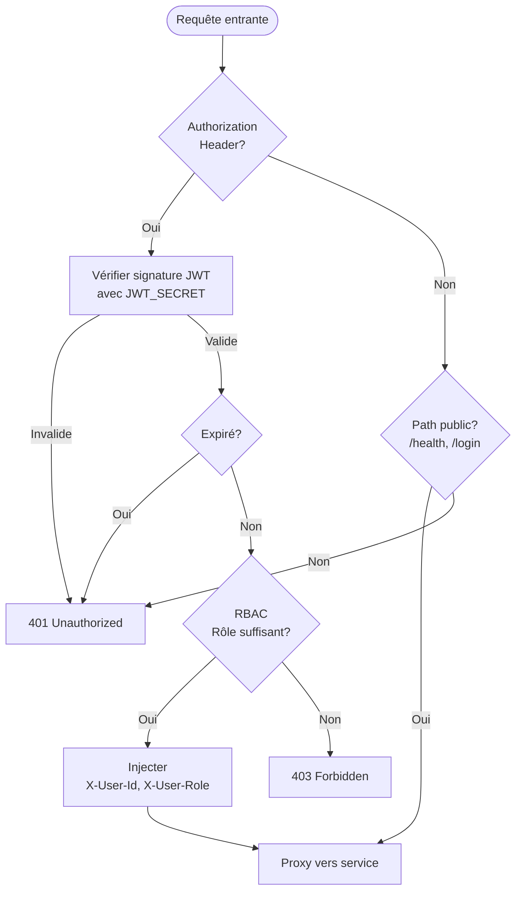

# DIGITRANS-CM — Schéma d'architecture détaillé

## 1. Architecture globale (vue macro)



## 2. Architecture des communications interservices



## 3. Architecture offline-first (Supply Chain)



## 4. Matrice de déploiement (3 environnements)

| Ressource | Dev (local) | Test (CI/CD) | Production (AWS) |
|-----------|-------------|--------------|-------------------|
| PostgreSQL | Docker local | Service GH Actions | RDS Multi-AZ |
| Redis | Docker local | Service GH Actions | ElastiCache |
| Auth Gateway | Port 3000 | ECR + ECS Staging | ECS Fargate |
| ERP Service | Port 3001 | ECR + ECS Staging | ECS Fargate |
| CRM Service | Port 3002 | ECR + ECS Staging | ECS Fargate |
| Supply Chain | Port 3003 | ECR + ECS Staging | ECS Fargate |
| BI Service | Port 3004 | ECR + ECS Staging | ECS Fargate |
| Domaine | localhost | staging.digitrans-cm.com | api.digitrans-cm.com |

## 5. Flux d'authentification OAuth 2.0 / JWT



## 6. Stack technologique

```
┌──────────────────────────────────────────────────┐
│                   DIGITRANS-CM                     │
├──────────┬──────────┬──────────┬──────────────────┤
│ Gatway   │ ERP/CRM  │ Supply   │ BI               │
│ Node.js  │ Node.js  │ Chain    │ Python 3.14      │
│ Express  │ Express  │ Node.js  │ FastAPI          │
│ JWT      │ Joi      │ Express  │ Pandas (planned) │
│ OAuth2   │ Swagger  │ Fabric   │ Matplotlib       │
│          │          │ SDK      │ (planned)        │
├──────────┴──────────┴──────────┴──────────────────┤
│ Infrastructure commune                             │
│ PostgreSQL 15 · Redis 7 · Docker · Terraform       │
│ GitHub Actions · AWS ECS · Azure AD                │
└────────────────────────────────────────────────────┘
```
