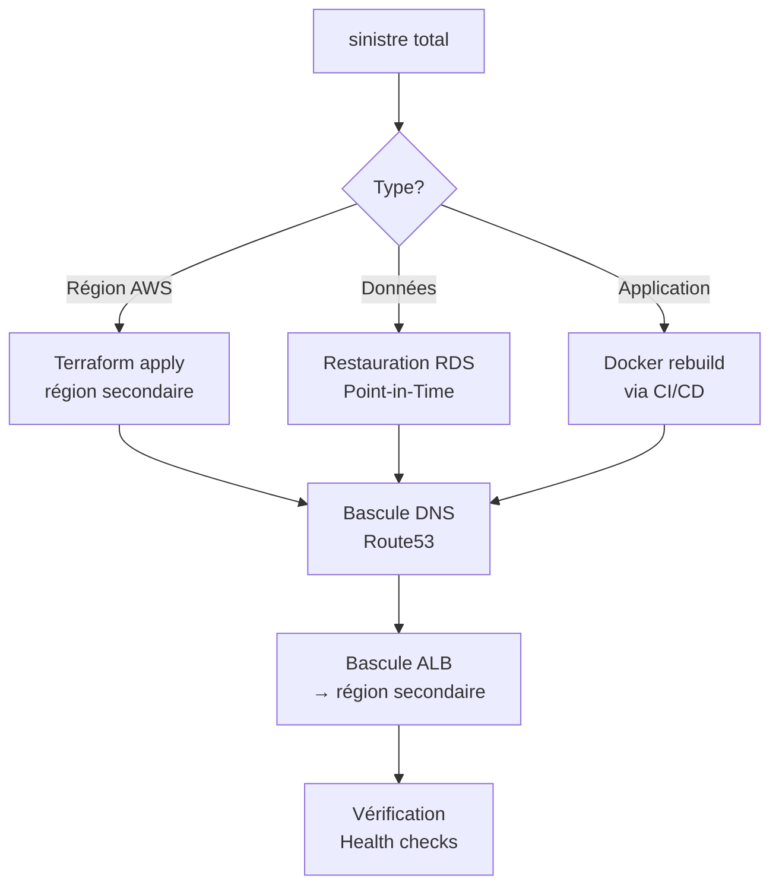

# DIGITRANS-CM — Sauvegarde et reprise après sinistre (DRP)

**Section 1.4.4** — BC04/EC04 — Mai 2026

---

## 1. Objectifs RTO / RPO

| Service | RTO (Recovery Time Objective) | RPO (Recovery Point Objective) | Priorité |
|---------|------------------------------|-------------------------------|----------|
| **Auth Gateway** | < 5 min | < 1 min | Critique |
| **ERP Service** | < 15 min | < 5 min | Haute |
| **CRM Service** | < 15 min | < 5 min | Haute |
| **Supply Chain** | < 30 min | < 10 min | Normale |
| **BI Service** | < 60 min | < 30 min | Basse |
| **RDS PostgreSQL** | < 5 min (Multi-AZ failover automatique) | < 1 min | Critique |
| **Redis Cache** | < 10 min | < 5 min | Haute |

**SLA cible :** 99,9 % de disponibilité (≈ 8,76 h d'arrêt max par an)

---

## 2. Stratégie de sauvegarde

### 2.1. RDS PostgreSQL

| Type | Fréquence | Rétention | Stockage |
|------|-----------|-----------|----------|
| Snapshots automatiques | Quotidien (03:00 UTC) | 30 jours (prod), 7 jours (dev/test) | S3 |
| WAL (Write-Ahead Log) | Continu (5 min) | 30 jours | S3 |
| Snapshots manuels | Avant chaque déploiement majeur | 90 jours | S3 |
| Export pg_dump | Hebdomadaire | 90 jours | S3 + Glacier après 180 jours |

### 2.2. S3 (Documents, assets)

| Mécanisme | Détail |
|-----------|--------|
| Versioning | Activé (prod) |
| Cycle de vie | Versions non courantes → supprimées après 90 jours |
| Réplication | Cross-region replication DR (prévoir 2e région) |

### 2.3. Docker Images (ECR)

| Mécanisme | Détail |
|-----------|--------|
| Scan de vulnérabilités | Activé (push) |
| Cycle de vie | Images non utilisées > 30 jours → expire |
| Backup | Toutes les images sont rebuildables via CI/CD |

### 2.4. Terraform State

| Mécanisme | Détail |
|-----------|--------|
| Backend | S3 (bucket digitrans-terraform-state) |
| Locking | DynamoDB |
| Versioning | Activé sur le bucket S3 |
| Backup | Export manuel hebdomadaire |

---

## 3. Procédures de restauration

### 3.1. Restauration RDS (Point-in-Time Recovery)

```bash
# Identifier le point de restauration
aws rds describe-db-instances \
  --db-instance-identifier digitrans-cm-prod-pg \
  --query 'DBInstances[0].LatestRestorableTime' \
  --region af-south-1

# Restaurer à un instant T
aws rds restore-db-instance-to-point-in-time \
  --source-db-instance-identifier digitrans-cm-prod-pg \
  --target-db-instance-identifier digitrans-cm-prod-pg-restored \
  --restore-time "2026-05-21T10:00:00Z" \
  --region af-south-1

# Renommer et basculer (si nécessaire)
aws rds modify-db-instance \
  --db-instance-identifier digitrans-cm-prod-pg-restored \
  --new-db-instance-identifier digitrans-cm-prod-pg \
  --apply-immediately \
  --region af-south-1
```

### 3.2. Restauration ECS (rollback déploiement)

```bash
# Revenir à la task definition précédente
aws ecs describe-services \
  --cluster digitrans-prod-cluster \
  --services auth-gateway-service \
  --query 'services[0].deployments' \
  --region af-south-1

# Forcer un déploiement avec l'image précédente
aws ecs update-service \
  --cluster digitrans-prod-cluster \
  --service auth-gateway-service \
  --force-new-deployment \
  --region af-south-1
```

### 3.3. Restauration complète (sinistre total)



### 3.4. Script de vérification post- restauration

```bash
#!/bin/bash
# check-recovery.sh — Vérification après restauration

ERRORS=0
for svc in auth-gateway:3000 erp-service:3001 crm-service:3002 supply-chain-service:3003 bi-service:3004; do
  name="${svc%%:*}"
  port="${svc##*:}"
  status=$(curl -sf "http://localhost:$port/health" | jq -r '.status')
  if [ "$status" != "ok" ]; then
    echo "❌ $name — status: $status"
    ((ERRORS++))
  else
    echo "✅ $name — OK"
  fi
done

# Vérification RDS
pg_isready -h "$DB_HOST" -U "$DB_USER" && echo "✅ RDS — OK" || { echo "❌ RDS — DOWN"; ((ERRORS++)); }

# Vérification Redis
redis-cli -u "$REDIS_URL" ping && echo "✅ Redis — OK" || { echo "❌ Redis — DOWN"; ((ERRORS++)); }

exit $ERRORS
```

---

## 4. Plan de continuité (BCP)

### 4.1. Scénarios de défaillance

| Scénario | Impact | Action | Délai |
|----------|--------|--------|-------|
| **ECS Fargate crash** | 1 service indisponible | Auto-restart (ECS) + HPA | < 1 min |
| **RDS Primary down** | Toutes les BDD indisponibles | Failover Multi-AZ automatique | < 60 s |
| **AZ complète down** | 50% des ressources perdues | HPA scale-up dans l'AZ restante | < 5 min |
| **Région AWS down** | Tout le système indisponible | Bascule vers région secondaire (Terraform) | < 2 h |
| **Incident sécurité** | Accès compromis | Rotation des clés + revue logs | < 30 min |

### 4.2. Tests DRP (calendrier recommandé)

| Test | Fréquence | Description |
|------|-----------|-------------|
| Restauration RDS PITR | Mensuel | Restaurer une BDD de test à J-7 |
| Failover Multi-AZ | Trimestriel | Simuler l'arrêt du primary RDS |
| Bascule région | Annuel | Terraform apply dans région secondaire |
| Restauration complète | Annuel | Sinistre total simulé |

---

## 5. Checklist restauration d'urgence

```markdown
## 🔴 Urgence — Service indisponible

1. [ ] Vérifier l'alerte CloudWatch / Prometheus
2. [ ] Diagnostiquer : `aws ecs describe-services --cluster ...`
3. [ ] Vérifier les logs : CloudWatch Logs Insights
4. [ ] Forcer un nouveau déploiement : `aws ecs update-service --force-new-deployment`
5. [ ] Vérifier le health check : `curl /health`
6. [ ] Si échec : restauration RDS PITR (section 3.1)
7. [ ] Documenter l'incident

## 🟡 Sinistre — Perte de données

1. [ ] Identifier le point de restauration (LatestRestorableTime)
2. [ ] Lancer PITR : `aws rds restore-db-instance-to-point-in-time`
3. [ ] Mettre à jour le endpoint RDS dans ECS task definition
4. [ ] Redéployer tous les services ECS
5. [ ] Vérifier l'intégrité des données
6. [ ] Exécuter le script check-recovery.sh
7. [ ] Documenter l'incident + RPO réel

## 🔴 CRITIQUE — Sinistre total région

1. [ ] Activer le plan DR : Terraform apply région secondaire
2. [ ] Restaurer RDS depuis le snapshot le plus récent
3. [ ] Redéployer ECS via CI/CD (dernière image stable)
4. [ ] Basculer DNS (Route53 vers 2e région)
5. [ ] Vérifier tous les health checks
6. [ ] Notifier les parties prenantes
7. [ ] Post-mortem sous 48h
```

---

*CAMTECH SOLUTIONS S.A. — Projet DIGITRANS-CM — 2025/2026*
