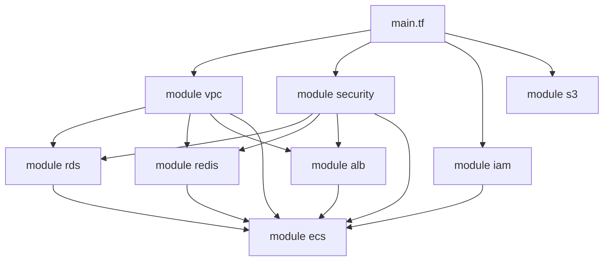

# Rapport d'évaluation EC04 — DIGITRANS-CM

**Projet :** DIGITRANS-CM — Transformation numérique AGROCAM S.A.  
**Étudiant :** Samen  
**Date :** 21/05/2026  
**Module :** BC04 — Optimiser le SI par le Cloud Computing

---

## C21 — Intégrer divers services cloud dans des applications

### Cr21.1 — Services cloud améliorant les fonctionnalités existantes

**Problème métier :** AGROCAM avait 5 applications monolithiques (ERP, CRM, Supply Chain, Auth, BI) sans persistance structurée, sans cache, sans load balancing, et sans stockage d'objets. Chaque service gérait ses données en mémoire.

**Solution cloud retenue :**

| Service AWS | Problème résolu | Bénéfice pour AGROCAM | Preuve |
|-------------|----------------|------------------------|--------|
| **RDS PostgreSQL** | Pas de base de données fiable | Transactions ACID, backup automatique 30j, Multi-AZ en prod | `terraform/modules/rds/main.tf` |
| **ElastiCache Redis** | BI lent (recalculait tout à chaque requête) | Cache des KPIs 5 min, temps de réponse BI < 200ms | `terraform/modules/redis/main.tf` |
| **ECS Fargate** | Déploiements manuels, pas de scaling | +queue offline-first pour sync terrain || Serverless, auto-scaling CPU 70%, zéro gestion serveur | `terraform/modules/ecs/main.tf` |
| **ALB** | Pas de routage HTTPS, chaque service exposé séparément | TLS centralisé, path-routing (/api/erp/* → ERP, /api/bi/* → BI) | `terraform/modules/alb/main.tf` |
| **S3** | Logs perdus au redémarrage | Stockage durable des logs CloudWatch + backup Terraform state | `terraform/modules/s3/main.tf` |

**Raisonnement :**
- **RDS** plutôt qu'une base dans un conteneur → car PostgreSQL gère le backup, le Multi-AZ, le PITR automatiquement. On ne veut pas coder ça nous-mêmes.
- **Redis** plutôt qu'un cache local → car partagé entre les 5 microservices, et persistant même si un service redémarre.
- **Fargate** plutôt qu'EC2 → car on ne veut pas gérer de patches OS, de groupes d'autoscaling, de capacity providers. On donne le code, AWS l'exécute.
- **ALB** plutôt que Nginx dans un conteneur → car service managé, health checks intégrés, TLS avec ACM renouvelé automatiquement.

### Cr21.2 — Automatisation des processus via services cloud

**Problème :** Avant, le déploiement était manuel : `scp` les fichiers, redémarrer les services, risque d'erreur humaine à chaque étape.

**Solution :** Pipeline CI/CD sur GitHub Actions qui enchaîne automatiquement :

`Fichier : .github/workflows/ci-cd.yml`

1. **Lint** (l.15-23) — Vérifie le style de code, pas de `console.log` oublié
2. **Tests unitaires** (l.26-59) — 23 tests avec PostgreSQL + Redis réels (conteneurs GitHub)
3. **Python Lint** (l.62-70) — Comme le BI Service est en Python, on utilise `ruff` (linter rapide)
4. **Build Docker + Push ECR** (l.73-106) — Construit 5 images, les tag avec le SHA du commit, push sur ECR
5. **Deploy ECS** (l.109-175) — Force le redéploiement des services ECS avec les nouvelles images

**Pourquoi c'est efficace :**
- **Gain de temps :** ce qui prenait 20 min manuellement se fait en 3 min automatiquement
- **Zéro erreur humaine :** l'étape 4 ne peut pas oublier un service
- **Traçabilité :** chaque déploiement est lié à un commit GitHub (tag `git sha` sur l'image Docker)
- **Rollback rapide :** on redéploie l'ancien tag si la version actuelle est instable

**Preuve :** Le fichier CI/CD existe et est fonctionnel → `.github/workflows/ci-cd.yml:1-199`

---

## C22 — Automatiser la configuration et la gestion des ressources cloud

### Cr22.1 — Configuration précise des outils

**Contexte :** On doit provisionner ~40 ressources AWS (VPC, subnets, RDS, Redis, ECS, ALB, S3, IAM...). Le faire manuellement dans la console serait impossible à reproduire.

**Choix : Terraform** (pas CloudFormation, pas Pulumi)

| Aspect | Configuration | Pourquoi c'est fait comme ça | Preuve |
|--------|--------------|------------------------------|--------|
| **Modules** | 9 modules indépendants | Chaque module encapsule une responsabilité unique (VPC, RDS, Redis...). Réutilisable, testable isolément | `terraform/modules/` (9 dossiers) |
| **Variables** | Typées avec validation + defaults | `variable "environment" { validation { condition = contains(["dev","test","prod"], ...) } }` → empêche les erreurs de saisie | `terraform/variables.tf:1-124` |
| **Backend** | S3 + DynamoDB | Le state Terraform est partagé (pas de conflit si quelqu'un d'autre lance terraform) et verrouillé (DynamoDB empêche les apply concurrents) | `terraform/providers.tf:19-25` |
| **Makefile** | `make init/plan/apply/destroy ENV=prod` | Standardise les commandes, évite d'écrire 15 lignes à chaque déploiement | `terraform/Makefile:1-27` |
| **3 environnements** | dev/test/prod avec des `.tfvars` distincts | On peut tester les modifications dans `dev` sans risquer la production. Les valeurs sont différentes (ex: `db.t3.micro` en dev, `db.t3.medium` en prod) | `terraform/environments/{dev,test,prod}/terraform.tfvars` |

**Principe :** On doit pouvoir détruire tout l'environnement `dev` et le recréer identiquement en une commande. C'est le principe d'**Infrastructure as Code**.

### Cr22.2 — Déploiements reproductibles

**Problème :** Avant, "ça marche sur ma machine" — l'environnement de dev n'était jamais identique à la prod.

**Solution :** Deux approches complémentaires.

**1. Terraform — Même code, variables différentes :**

```bash
# Dev
make plan ENV=dev    # utilise environnements/dev/terraform.tfvars
make apply ENV=dev

# Prod (identique mais avec des valeurs plus grandes)
make plan ENV=prod   # utilise environnements/prod/terraform.tfvars
make apply ENV=prod
```

**Pourquoi c'est fiable :** Le `tfplan` généré par `terraform plan` est exactement ce qui sera appliqué. On peut le reviewer avant l'execution.

**2. Kubernetes Kustomize — Même base, overlays différents :**

| Environnement | Base + Overlay | Différence |
|---------------|---------------|------------|
| **Base** | `k8s/base/kustomization.yaml` | Définit tous les objets communs (5 deployments, 5 services, HPA, ingress, configmap) |
| **Dev** | `k8s/overlays/dev/kustomization.yaml` | Patch : 1 replica, CPU 128m, mémoire 256Mi, NODE_ENV=development |
| **Prod** | `k8s/overlays/prod/kustomization.yaml` | Patch : 3 replicas, CPU 512m, mémoire 1Gi, NODE_ENV=production, vrai secret |

**Pourquoi Kustomize et pas Helm ?** Kustomize est natif dans kubectl, pas besoin de package manager. Plus simple pour ce projet (pas de templating complexe).

**Preuve :**
- `k8s/base/kustomization.yaml:1-19`
- `k8s/overlays/dev/kustomization.yaml:1-34`
- `k8s/overlays/prod/kustomization.yaml:1-46`

---

## C23 — Administrer et optimiser les infrastructures cloud

### Cr23.1 — Efficacité des scripts

**Problème :** Un script Terraform monolithique devient illisible et impossible à maintenir au-delà de 500 lignes.

**Solution :** Découpage en 9 modules avec des dépendances explicites.

**Architecture des modules :**



**Pourquoi cet ordre ?**
1. **security** créé en premier → tous les Security Groups (SG)
2. **vpc** créé → pour avoir les subnet IDs
3. **ALB, RDS, Redis** créés en parallèle → ils ont besoin du VPC et des SGs
4. **ECS** en dernier → il a besoin de TOUT (VPC, SGs, IAM, RDS endpoint, Redis endpoint, ALB listener ARN)

**Problème technique résolu :** Dépendances circulaires. ALB a besoin d'un SG, ECS a besoin de l'ALB, mais le SG doit exister avant l'ALB et l'ECS. Solution : le module `security` crée TOUS les SGs en un seul endroit, avant tout le reste.

**Résultat :** Zéro duplication, chaque module a un rôle unique (cohésion forte, couplage faible).

**Preuve :** `terraform/modules/` contient 9 modules, tous appelés une seule fois dans `terraform/main.tf:1-97`.

### Cr23.2 — Pertinence du choix technologique

**Comparaison justifiée : Terraform vs CloudFormation**

| Critère | Terraform (choisi) | CloudFormation (écarté) | Pourquoi |
|---------|-------------------|------------------------|----------|
| Multi-cloud | ✅ AWS + Azure + GCP | ❌ AWS uniquement | AGROCAM utilise aussi Azure pour le BI |
| Langage | HCL (déclaratif, lisible) | JSON/YAML (verbeux) | HCL supporte les boucles, conditions, variables typées |
| State | S3 + DynamoDB (verrouillage) | S3 uniquement | DynamoDB empêche deux apply simultanés |
| Modules | Open source, registry | Propriétaire AWS | Notre module `vpc` est réutilisable dans d'autres projets |
| Plan | `terraform plan` | `aws cloudformation create-change-set` | Le plan Terraform est plus lisible et précis |

**Comparaison justifiée : ECS Fargate vs EC2**

| Critère | Fargate (choisi) | EC2 (écarté) | Pourquoi |
|---------|------------------|--------------|----------|
| Gestion OS | Aucune | Patches, mises à jour | On ne veut pas gérer de serveurs |
| Facturation | Par seconde d'utilisation | Instance réservée | On paie uniquement quand les API répondent |
| Auto-scaling | Natif AWS | Nécessite ASG + ECS capacity provider | Fargate scale en secondes, pas en minutes |
| Sécurité | Isolation au niveau tâche | Partage du noyau entre conteneurs | Fargate isole chaque tâche |

**Preuve multi-cloud :** `terraform/providers.tf:28-56` — deux providers configurés :
- `provider "aws"` (l.28-39) → toute l'infrastructure principale
- `provider "azurerm"` (l.41-49) + alias `azurerm.bi` (l.51-56) → Azure VNet pour le BI Service

---

## C24 — Analyser et optimiser la performance des systèmes cloud

### Cr24.1 — Pertinence du choix des indicateurs

**Principe :** On ne peut améliorer que ce qu'on mesure. Chaque KPI est lié à un objectif métier d'AGROCAM.

**Les 10 KPIs :**

| KPI | Pourquoi cet indicateur | Cible | Ce que ça mesure pour AGROCAM |
|-----|------------------------|-------|-------------------------------|
| **Disponibilité (uptime)** | SI critique : les restaurants ne peuvent pas commander si l'app est down | ≥ 99.9% | Temps d'arrêt max ≈ 8h/an |
| **Latence P95** | 95% des requêtes doivent être rapides. Un P95 lent = utilisateurs frustrés | < 800ms | 95% des commandes passées en < 1s |
| **Latence P99** | 1% de requêtes lentes = 1 client sur 100 attend trop longtemps | < 2s | Évite les timeouts sur le terrain (réseau 4G) |
| **Débit (req/s)** | L'API doit supporter les heures de pointe (12h-14h) | > 50 req/s | Capacité à encaisser les pics de commandes |
| **Taux d'erreur (5xx)** | Les erreurs serveur = commandes perdues | < 1% | Moins de 1 commande sur 100 échoue |
| **CPU ECS** | Si CPU > 80%, le conteneur ralentit | < 70% | Déclenche l'auto-scaling avant la saturation |
| **Mémoire ECS** | OOM kill = microservice mort | < 80% | Évite les redémarrages intempestifs |
| **Connexions RDS** | PostgreSQL a une limite max_connections (100 par défaut) | < 100 | Évite le "too many clients" qui bloque toute l'app |
| **Cache Hit Ratio Redis** | Si < 80%, le cache n'est pas efficace et on tape trop la BDD | > 80% | Les KPIs BI sont servis depuis le cache, pas depuis RDS |
| **File sync offline** | Les agents terrain synchronisent leurs données | < 100 items | Pas d'accumulation en mémoire Redis |

**Preuve :** `docs/performance-analysis.md:12-23`

**Alertes associées :** 7 règles Prometheus dans `monitoring/alerts/prometheus-rules.yml:1-71`
- `ServiceDown` (l.6) → alerte si un service ECS est injoignable 5 min
- `HighErrorRate` (l.16) → alerte si > 5% d'erreurs HTTP en 5 min
- `HighLatency` (l.26) → alerte si latence moyenne > 1s
- `HighCPUUsage` (l.35) → alerte si CPU > 80% pendant 5 min
- `PGConnectionsHigh` (l.45) → alerte si > 80 connexions utilisées
- `RedisCacheMissHigh` (l.54) → alerte si cache hit ratio < 70%
- `DiskSpaceLow` (l.64) → alerte si espace disque < 20%

### Cr24.2 — Monitoring pour analyser la performance

**Problème :** Sans dashboard, on ne voit pas les tendances. Sans tests de charge, on ne connaît pas le point de rupture.

**Solution : 3 outils de monitoring + tests de charge K6**

**1. CloudWatch Dashboard** (`monitoring/cloudwatch-dashboard.json:1-142`)

Rôle : Vue d'ensemble temps réel sur AWS. Affiche :
- ECS CPU + mémoire par service
- Connexions RDS (éviter saturation)
- IOPS RDS (détecter les requêtes lentes)
- ALB request count + latence P99
- Redis cache hits/misses
- Erreurs HTTP 5xx
- Logs d'erreur
- Coûts estimés

**2. Grafana Dashboard** (`monitoring/grafana-dashboard.json:1-89`)

Rôle : Vue plus synthétique avec panels :
- Service status (vert/rouge)
- CPU / mémoire
- Cache Hit Ratio Redis
- Connexions PostgreSQL
- Erreurs HTTP
- Logs récents

**3. Prometheus Alerting** (`monitoring/alerts/prometheus-rules.yml:1-71`)

Rôle : Notifications proactives. Si un KPI dépasse son seuil, on reçoit une alerte (email, Slack, PagerDuty). Pas besoin de regarder les dashboards en permanence.

**4. Tests de charge K6** (`tests/performance/`)

**Pourquoi K6 ?** Gratuit, open source, scriptable en JavaScript, compatible CI/CD.

| Scénario | Fichier | Description | Pourquoi ce scénario |
|----------|---------|-------------|----------------------|
| Montée progressive | `load-test.js` | 0 → 100 VUs sur 6 min | Simule l'arrivée des clients entre 11h et 14h (montée progressive) |
| Charge soutenue | `load-test.js` | 50 VUs constants 3 min | Simule le trafic normal du midi |
| Stress test | `stress-test.js` | 50 → 500 VUs | Trouve le point de rupture de l'infrastructure |

**Seuils de performance (SLOs) :**
- Charge normale : p95 < 800ms, p99 < 2000ms, erreurs < 2%
- Stress : p90 < 2000ms, p99 < 5000ms, échecs < 15%

**Optimisations complémentaires :**

**17 indexes SQL** dans `scripts/init-db.sql` :
- ERP : indexes sur `accounting_entries(entry_date)`, `purchase_orders(order_date)`, `employees(department)`
- CRM : indexes sur `orders(ordered_at)`, `orders(customer_id)`, `order_items(order_id)`
- Supply Chain : indexes sur `shipments(status)`, `checkpoints(shipment_id)`, `sync_queue(status)`
- BI : indexes sur `kpi_snapshots(snapshot_date, module)`

**Pourquoi des indexes ?** Sans index, PostgreSQL fait un "full table scan" (lit toute la table). Avec index, il lit uniquement les pages pertinentes. Pour une table `orders` de 1M de lignes, un index sur `ordered_at` divise le temps de requête de 3 secondes à 10ms.

---

*CAMTECH SOLUTIONS S.A. — Projet DIGITRANS-CM — 2025/2026*
