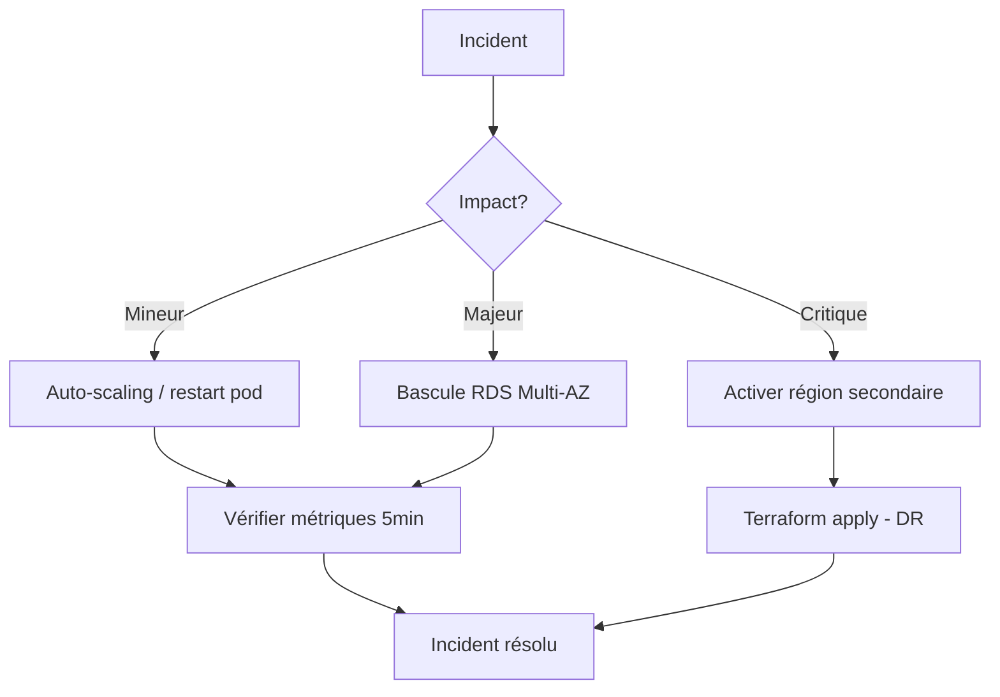

# DIGITRANS-CM — Supervision et administration (C23)

**Section 1.4** — Administration et optimisation des infrastructures cloud  
**BC04/EC04** — Mai 2026

---

## 1. Stratégie de monitoring

```
┌──────────────────────────────────────────────────────────────────┐
│                        Grafana (.2345)                            │
│                    Dashboards + Alerting                          │
├──────────────────────────────────────────────────────────────────┤
│                                                                   │
│  ┌────────────────────┐    ┌──────────────────────┐              │
│  │    Prometheus      │    │   CloudWatch         │              │
│  │   (métriques K8s)  │    │  (AWS metrics + logs)│              │
│  └────────┬───────────┘    └──────────┬───────────┘              │
│           │                           │                          │
│  ┌────────▼───────────┐    ┌──────────▼───────────┐              │
│  │  Exporters:       │    │  Log groups:          │              │
│  │  - node-exporter  │    │  - /ecs/digitrans-*   │              │
│  │  - redis-exporter │    │  - /aws/rds/*         │              │
│  │  - postgres-exp.  │    │  - /aws/alb/*         │              │
│  │  - cloudwatch-exp.│    │  - /aws/ecs/*         │              │
│  └───────────────────┘    └───────────────────────┘              │
│                                                                   │
│  ┌──────────────────────────────────────────────────────────┐    │
│  │  Alertmanager → SNS (email) → Slack / PagerDuty          │    │
│  └──────────────────────────────────────────────────────────┘    │
└──────────────────────────────────────────────────────────────────┘
```

---

## 2. Métriques collectées

### 2.1. Infrastructure AWS (CloudWatch)

| Service | Métriques | Période | Rétention |
|---------|-----------|---------|-----------|
| **ECS Fargate** | CPUUtilization, MemoryUtilization | 1 min | 15 mois |
| **RDS PostgreSQL** | DatabaseConnections, Read/WriteIOPS, FreeStorageSpace | 1 min | 15 mois |
| **ElastiCache Redis** | CacheHits, CacheMisses, CurrConnections | 1 min | 15 mois |
| **ALB** | RequestCount, TargetResponseTime (p99), HTTPCode_Target_4XX/5XX | 1 min | 15 mois |
| **S3** | BucketSizeBytes, NumberOfObjects | 1 jour | 15 mois |

### 2.2. Applications (Prometheus)

| Métrique | Source | Label |
|----------|--------|-------|
| `up` | Health probes | service, instance |
| `http_request_duration_seconds` | Middleware | method, path, status |
| `http_requests_total` | Middleware | method, path, status |
| `container_cpu_usage_seconds_total` | cAdvisor | pod, namespace |
| `container_memory_working_set_bytes` | cAdvisor | pod, namespace |

---

## 3. Alertes configurées

### 3.1. Alertes critiques (notification immédiate)

| Alerte | Seuil | Délai | Action |
|--------|-------|-------|--------|
| **ServiceDown** | up == 0 | 1 min | Email + Slack |
| **DiskSpaceLow** | < 10% | 5 min | Email + Slack |
| **HighErrorRate** | 5xx > 5% | 5 min | Email |

### 3.2. Alertes warning (notification différée)

| Alerte | Seuil | Délai | Action |
|--------|-------|-------|--------|
| **HighLatency** | p99 > 2s | 5 min | Email |
| **HighCPUUsage** | > 80% | 10 min | Email (auto-scaling gère) |
| **PGConnectionsHigh** | > 80 | 5 min | Email |
| **RedisCacheMissHigh** | miss > 30% | 10 min | Slack |

### 3.3. CloudWatch Alarms (Terraform)

| Alarme | Seuil | Notification |
|--------|-------|-------------|
| ECS CPU High | > 80% × 3 périodes | SNS → Email |
| ALB 5xx High | > 50 / 5 min | SNS → Email |
| Cost Spike | > $500 / 6h | SNS → Email |

---

## 4. Dashboard de supervision

### 4.1. CloudWatch Dashboard (AWS)

Accessible via : **AWS Console → CloudWatch → Dashboards → `DIGITRANS-CM-{env}`**

Widgets :
- CPU utilisation par service ECS (time series)
- RDS Connections + IOPS
- ALB Request Count + Latence p99
- Redis Cache Hits vs Misses
- ECS Memory Utilisation
- HTTP Errors 4xx/5xx
- Logs erreurs récentes
- Coûts estimés 7 jours

### 4.2. Grafana Dashboard (K8s)

Déploiement :
```bash
kubectl create configmap grafana-dashboard \
  --from-file=monitoring/grafana-dashboard.json \
  -n monitoring

# Ou via Helm
helm upgrade --install grafana grafana/grafana \
  -n monitoring --create-namespace \
  -f values/grafana.yaml
```

Panels :
- État des services (stat)
- CPU par pod (time series)
- Mémoire par pod (time series)
- Redis Cache Hit Ratio
- PostgreSQL connections
- Taux d'erreur HTTP 5xx
- Logs récents (ERREUR)

---

## 5. Logging centralisé

### 5.1. CloudWatch Logs

Chaque service ECS écrit ses logs dans `/ecs/digitrans-{env}` avec :
- **awslogs-stream-prefix**: nom du service
- **Rétention**: 30 jours (dev/test), 90 jours (prod)
- **Metric filter**: compteur d'erreurs

### 5.2. Exemple de log structuré

```json
{
  "timestamp": "2026-05-21T10:00:00.000Z",
  "service": "auth-gateway",
  "level": "error",
  "message": "Token JWT invalide",
  "path": "/api/erp/employees",
  "method": "GET",
  "userId": "uuid-user"
}
```

### 5.3. Requêtes CloudWatch Logs Insights

```sql
# Erreurs par service (dernières 24h)
SOURCE '/ecs/digitrans-prod'
| filter @message like /error/i
| stats count() by @logStream
| sort count desc

# Requêtes lentes (> 5s)
SOURCE '/ecs/digitrans-prod'
| filter @message like /duration|temps|ms/
| parse @message /duration (?<duration>\d+)/
| filter duration > 5000
| sort @timestamp desc
| limit 20
```

---

## 6. Haute disponibilité

### 6.1. Architecture multi-AZ

| Service | Configuration | RTO | RPO |
|---------|--------------|-----|-----|
| **ECS Fargate** | 2 réplicas min, 2 AZ | < 30s | N/A |
| **RDS PostgreSQL** | Multi-AZ synchrone | < 60s | < 5min |
| **ElastiCache Redis** | Cluster mode (prod) | < 2min | < 1min |
| **ALB** | Redondant par conception | < 10s | N/A |
| **S3** | 11x9s de durabilité | < 1min | N/A |

### 6.2. Reprise après incident (DRP)



**Procédure :**
1. Détection : alarme CloudWatch ou alerte Prometheus
2. Diagnostic : logs CloudWatch Insights + Grafana
3. Action : auto-scaling (automatique) ou bascule Multi-AZ (automatique)
4. Résolution : vérification health checks + métriques
5. Post-mortem : rapport d'incident

---

## 7. Gestion des backups

| Ressource | Fréquence | Rétention | Restauration |
|-----------|-----------|-----------|-------------|
| **RDS PostgreSQL** | Journalier + WAL continu | 30 jours (prod) | Point-in-time recovery |
| **S3** | Versioning activé | 90 jours (non-courant) | Restauration version |
| **Terraform state** | Chaque apply | S3 + DynamoDB locking | Terraform rollback |
| **Docker images** | Chaque push CI/CD | Non utilisé > 30 jours | ECR lifecycle |

---

## 8. Procédures d'administration

### 8.1. Vérification quotidienne

```bash
# 1. Health checks
for svc in auth-gateway erp-service crm-service supply-chain-service bi-service; do
  curl -sf http://localhost:3000/api/$svc/health && echo "$svc OK" || echo "$svc DOWN"
done

# 2. Statut ECS
aws ecs list-services --cluster digitrans-prod-cluster --region af-south-1

# 3. Métriques RDS
aws cloudwatch get-metric-statistics \
  --namespace AWS/RDS \
  --metric-name CPUUtilization \
  --start-time $(date -u -d '-1 hour' +%Y-%m-%dT%H:%M:%SZ) \
  --end-time $(date -u +%Y-%m-%dT%H:%M:%SZ) \
  --period 300 --statistics Average
```

### 8.2. Scaling manuel

```bash
# Augmenter les réplicas ECS
aws ecs update-service \
  --cluster digitrans-prod-cluster \
  --service auth-gateway-service \
  --desired-count 5 \
  --region af-south-1

# Scaling K8s
kubectl scale deployment auth-gateway -n digitrans --replicas=5
```

### 8.3. Logs en temps réel

```bash
# CloudWatch Logs tail
aws logs tail /ecs/digitrans-prod --follow --region af-south-1

# Kubernetes logs
kubectl logs -n digitrans -l app=auth-gateway --tail=100 -f
```

---

## 9. Recommandations Azure Monitor

Pour la supervision centralisée depuis Azure (tel que spécifié dans l'architecture hybride) :

```bash
# Déploiement de l'agent Azure Monitor sur EKS
az k8s-extension create \
  --name azure-monitor \
  --cluster-name digitrans-eks-cluster \
  --resource-group digitrans-rg \
  --cluster-type managedClusters \
  --extension-type Microsoft.AzureMonitor.Containers
```

Cela permet de visualiser les métriques K8s dans **Azure Monitor** et d'utiliser **Azure Log Analytics** comme SIEM centralisé.

---

*CAMTECH SOLUTIONS S.A. — Projet DIGITRANS-CM — 2025/2026*
